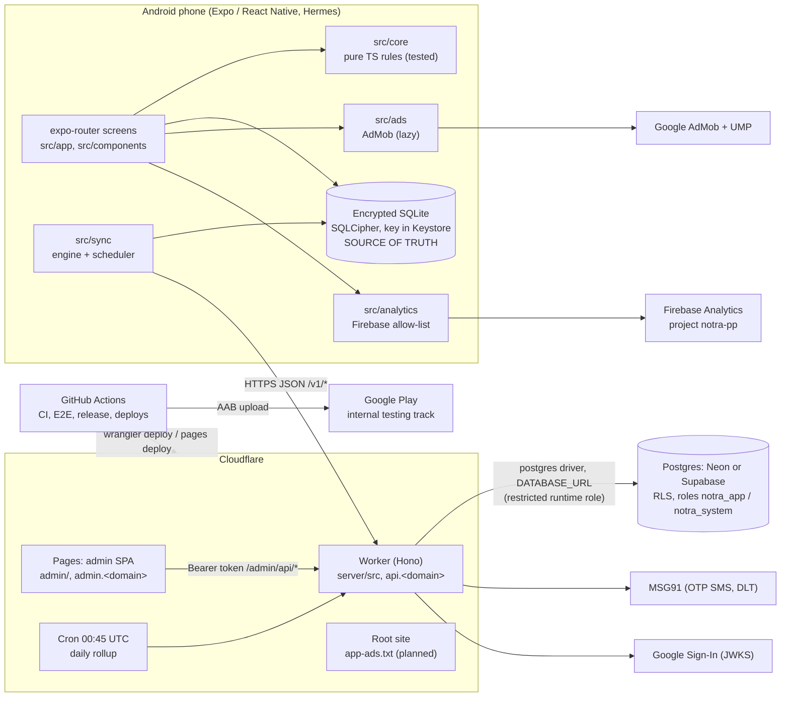
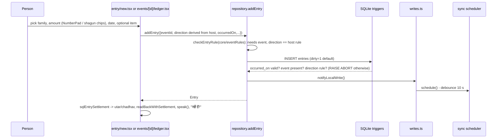
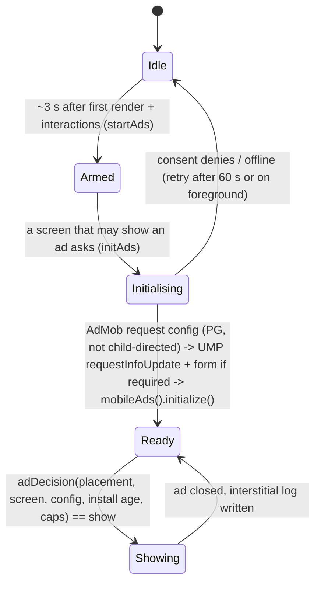
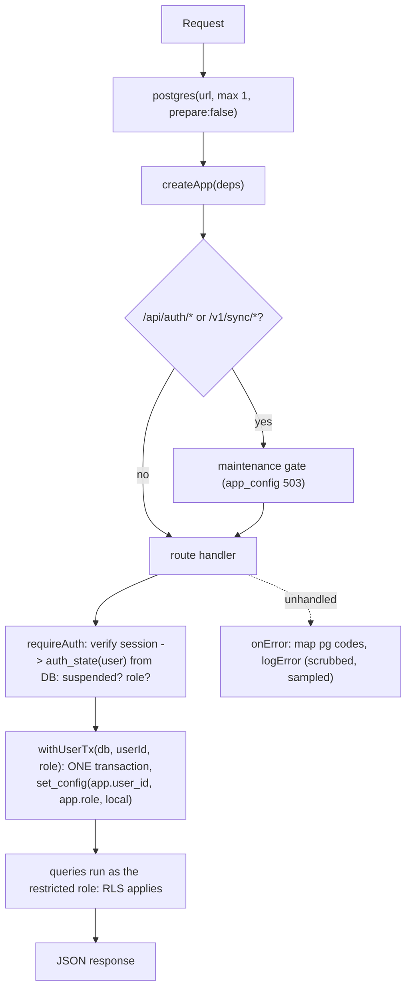

# Architecture

Notra Book (नोतरा बुक, Android package `app.notra.book`) is an **offline-first** ledger for the Notra custom (interest-free,
document-free reciprocal gifting). The phone is the source of truth; the cloud is an optional, opt-in copy.

This page is the map. Detail lives in: [DATA_MODEL.md](DATA_MODEL.md) (tables and rules), [SYNC.md](SYNC.md) (protocol),
[SECURITY_PRIVACY.md](SECURITY_PRIVACY.md) (threat model), [ADMIN.md](ADMIN.md) (staff panel), [ADS.md](ADS.md) (AdMob),
[CI_CD.md](CI_CD.md) and [DEPLOYMENT.md](DEPLOYMENT.md).

## 1. System overview



Key properties:

- **Nothing blocks on the network.** Every screen reads and writes the local database. Sync, remote config, ads, analytics
  and support tickets are best effort and fail silently (`src/sync/scheduler.ts`, `src/remote/fetch.ts`).
- **One codebase for rules.** `src/core` is pure TypeScript (no React or Expo imports). The same rules are re-implemented
  in SQL (`src/db/queries.ts`, `src/db/reports.ts`, migration v7 triggers and views) and in the Worker
  (`server/src/sync.ts` `enforceDirections`). Tests assert **SQL == core** (see [DEVELOPMENT.md](DEVELOPMENT.md)).
- **Vendor neutral backend.** The Worker speaks plain SQL through the `postgres` driver (`prepare: false`, so poolers
  work). Neon or Supabase is just a `DATABASE_URL`. Hyperdrive is an optional binding in `server/wrangler.toml`.
- **Privacy is enforced in the database**, not only in the API: Row Level Security, `SECURITY DEFINER` functions and
  k-anonymous aggregates. Staff cannot read diaries (see [SECURITY_PRIVACY.md](SECURITY_PRIVACY.md)).

## 2. Repository layout

```
app.json, app.config.js, eas.json   Expo config (permissions, plugins), dynamic AdMob/Firebase switching, EAS profiles
google-services.json, firebase.json Firebase (Android) config; analytics collection defaults all "off" until runtime consent
src/                                the app (Expo SDK 57, React Native 0.86, TypeScript strict)
modules/notra-contact-picker/       local Expo module (Kotlin): pick ONE contact without READ_CONTACTS
plugins/                            Expo config plugins: withReleaseSigning.js, withFirebaseAndroid.js
scripts/                            e2e-run.sh (Maestro runner), check-signing-plugin.js
.maestro/                           end-to-end flows 01..09 + subflows
server/                             Cloudflare Worker (Hono) + Postgres migrations + vitest suite (own package.json)
admin/                              staff web app (React 19, Vite, Tailwind 4), own package.json
docs/                               this documentation
.github/workflows/                  ci.yml, e2e.yml, release.yml, deploy-server.yml, admin.yml
```

## 3. Module breakdown: `src/` (the app)

| Module | Responsibility | Key files |
| --- | --- | --- |
| `src/core/` | Pure domain logic: types, money, ledger math, उतार/चढ़ाव, direction rules, reports models, search, PIN hashing, Hindi words, voice parsing. No React/Expo. | `types.ts`, `ledger.ts` (activeEntries, balances, suggestReturn), `money.ts` (formatINR, roundUpToShagun), `settlement.ts`, `eventRules.ts`, `reports.ts`, `reportDocs.ts` (one model feeds PDF and image), `search.ts`, `match.ts`, `pin.ts`, `ledgers.ts`, `words.ts`, `voice.ts`, `readback.ts`, `labels.ts` |
| `src/db/` | expo-sqlite access: opening + key, ordered migrations, repositories, aggregate SQL, reports SQL, ledger/PIN storage, maintenance (wipe), legacy-event helper | `database.ts` (getDb), `key.ts`, `migrations.ts` (v1..v7), `repository.ts`, `queries.ts`, `reports.ts`, `ledgers.ts`, `legacy.ts`, `maintenance.ts`, `writes.ts` (onLocalWrite pub/sub), `mem-db.testutil.ts` |
| `src/sync/` | Cloud backup engine: collect dirty rows, push batches, apply pulled pages, scheduler with backoff, account binding, profile sync, rejected-row tracking, HTTP client (Better Auth session cookie) | `engine.ts`, `scheduler.ts`, `runtime.ts` (wiring), `http.ts`, `wire.ts`, `account.ts`, `profile.ts`, `rejected.ts`, `state.ts` |
| `src/auth/` | Better Auth client wrapper (Expo client, session cookie in secure store), lazy Google sign-in, Hindi error messages, account switching prompt | `client.ts`, `auth-api.ts`, `session.ts`, `google.ts`, `messages.ts`, `switch-prompt.ts`, `after-signin.ts` |
| `src/backup/` | Password-encrypted backup **file** (no account needed): scrypt + XChaCha20-Poly1305, snapshot build / validate / merge | `crypto.ts`, `snapshot.ts`, `index.ts` |
| `src/remote/` | Remote config (`GET /v1/config`): defaults baked in, defensive parser, cache in SQLite, maintenance / force-update / announcement state, device headers | `config.ts`, `fetch.ts`, `state.ts`, `device.ts`, `online.ts` |
| `src/ads/` | AdMob: pure policy, ids, slots; lazy SDK service; banner and native components | `policy.ts` (adDecision), `service.ts`, `units.ts`, `slots.ts`, `state.ts`, `AdBanner.tsx`, `NativeAdCard.tsx` |
| `src/analytics/` | Firebase Analytics behind a closed allow-list and consent logic | `events.ts` (allow-list + sanitizer), `consent.ts`, `index.ts` (`track`), `native.ts` (only file touching Firebase), `use-analytics.ts` |
| `src/support/` | Grievance / suggestion tickets (offline queue) and consented support access | `logic.ts` (pure), `service.ts` |
| `src/ledgers/` | Which ledger is open and which PIN ledgers are unlocked (memory only) | `session.ts`, `pin-flow.ts` |
| `src/legal/` | ONE source of privacy / terms / grievance / delete-account text for app screens **and** Worker pages | `content.ts` |
| `src/onboarding/` | Picture cards (spoken Hindi) and per-screen help text | `content.ts`, `help.ts` |
| `src/services/` | Thin wrappers around native things, loaded on tap: contact picker, PDF/share, haptics, speech, voice input, photo, toast, `guarded()` | `contact-picker.ts`, `export.ts`, `report-export.ts`, `voice-input.ts`, `guard.ts` |
| `src/hooks/` | `useLoad` (DB loader scoped to the open ledger, reruns on focus), `useActiveLedger`, `usePaged`, `useReduceMotion` | `use-load.ts` |
| `src/components/` | Design-system pieces: `Screen`, `BigButton`, `NumberPad`, `Calendar`, `HouseholdPicker`, report sheet/export, icons and motifs, notice banners, force-update overlay | see [DEVELOPMENT.md](DEVELOPMENT.md) |
| `src/theme.ts` | The only place for colours, fonts, spacing; also the contrast pairs the test checks | `colors`, `type`, `textPairs` |
| `src/app/` | expo-router routes (see routes table below) | `_layout.tsx`, `(tabs)/` |
| `src/features.ts`, `src/nav.ts` | Feature flag (`diaryPhotoImport`), untyped navigation helpers | |

### Routes (`src/app`)

| Route | Screen |
| --- | --- |
| `(tabs)/index` घर | summary, 3 quick actions, calendar, परिवार, रिश्ते/इनाम cards, settings gear; also decides first-run routing |
| `(tabs)/notra` नोतरा | segments मेरा (programs I host, receive only) · दूसरों का (give only) · हिसाब (totals, reports, पुराना हिसाब); bodies in `src/features/notra/`; `?seg=mera\|doosre\|hisab` |
| `(tabs)/rishte` रिश्ते | private on-phone biodata builder (flag `FEATURES.rishte`; JSON in settings key `biodata_v1`) |
| `(tabs)/inaam` इनाम | points, levels, badges from local activity (`src/core/rewards.ts`) |
| `events/new`, `events/[id]`, `events/[id]/ledger` | create my program, its page, its खाता (record who came) |
| `others/new`, `entry/new` | "नए नोतरे में गए" (pick host, occasion, date) then write the amount |
| `old` | पुराना हिसाब जोड़ें (past dates; photo import card "जल्द आ रहा है") |
| `households/*`, `ledger/[direction]`, `ledgers` | family directory/detail/edit, full received/given lists, personal ledgers + PINs |
| `reports/{given,guests,notcome,occasion,pending,person,self,year}` | the eight reports |
| `settings`, `signin`, `phone`, `setup`, `onboarding` | hub, Google sign-in, OTP, first-run household, picture cards |
| `backup`, `sync-errors`, `account-delete`, `app-lock` | backup file create/restore, rejected rows, delete cloud account, app PIN |
| `support`, `support-access`, `legal/[id]` | tickets, consented access, legal text |

## 4. Module breakdown: `server/src` (the Worker)

| Module | Responsibility | Key files |
| --- | --- | --- |
| Entry | One short-lived Postgres connection per request; `scheduled()` for the cron rollup | `worker.ts` |
| App | Hono app: all `/v1/*` routes, auth middleware (`requireAuth`), maintenance gate, error mapping, public pages | `app.ts` |
| Config | Env bindings, `loadConfig`, `smsFromEnv`, `adminFromEnv` | `config.ts` |
| DB | `Db`/`Queryable` interfaces, `fromPostgres`, **`withUserTx`** (sets `app.user_id`, `app.role` per transaction), `setUserContext` | `db.ts` |
| Auth | Google + mobile OTP sign-in and sessions: self-hosted Better Auth in the Worker (`docs/AUTH.md`): instance + hooks, Kysely dialect over `Db` (sets `app.auth` per statement), OTP guard, error mapping, MSG91 | `auth/better-auth.ts`, `dialect.ts`, `otp-guard.ts`, `errors.ts`, `google.ts`, `phone.ts`, `sms.ts` |
| Users | `users` is Better Auth's `user` table: `getUser`, `publicUser`, `authState` | `users.ts` |
| Sync | Per-row validation, set-based upserts, pull pages, direction enforcement | `validate.ts`, `sync.ts` |
| Account | Delete everything for a user in one transaction | `account.ts` |
| Support | Tickets (rate limit 5/h, grievance due in 30 days), consented support-access grants (<= 7 days) | `support.ts` |
| Remote config | Known keys, validators, defaults, history | `appconfig.ts` |
| Abuse | Blocklist check, durable OTP event log | `blocklist.ts` |
| Telemetry | Client info headers, per-day activity counters, scrubbed error log | `telemetry.ts` |
| Rollup | Nightly `analytics.rollup_day` for the last 7 days + purge | `rollup.ts` |
| Pages | `/privacy`, `/terms`, `/grievance`, `/delete-account` from `src/legal/content.ts` | `pages.ts` |
| Admin API | `/admin/api/*`: role gate, one RLS transaction per request, response privacy guard, audit | `admin/api.ts`, `admin/kit.ts`, `admin/auth.ts`, `admin/privacy.ts`, `admin/mask.ts`, and route files `users.ts`, `tickets.ts`, `config.ts`, `abuse.ts`, `monitoring.ts`, `reports.ts`, `staff.ts`, `supportview.ts` |

## 5. Module breakdown: `admin/src` (the staff panel)

React 19 + react-router + Tailwind 4, built by Vite. No data library. Staff sign in with the app's own Google / OTP
endpoints; the role is read **by the server** from the database.

| Area | Files | Notes |
| --- | --- | --- |
| Shell | `main.tsx`, `App.tsx`, `components/Layout.tsx`, `components/ui.tsx`, `components/charts.tsx`, `styles.css` | lazy-loaded pages; light/dark theme in localStorage |
| Auth + API | `lib/auth.tsx`, `lib/api.ts`, `lib/roles.ts` | Better Auth session token (from `set-auth-token`) in `sessionStorage`, sent as a Bearer; `roles.ts` mirrors the server gates (UI only, server is the authority) |
| Pages | `Dashboard`, `Users`, `UserDetail` (consented data viewer), `Tickets`, `Config`, `Abuse`, `Monitoring`, `Reports`, `Staff`, `Audit`, `Login` | one per sidebar entry |
| Helpers | `lib/mask.ts`, `format.ts`, `types.ts`, `useApi.ts` | |
| Tests | `*.vtest.ts(x)` (jsdom) | named `vtest` so the app's Jest run does not pick them up |

## 6. Runtime flows

### 6.1 App startup

```mermaid
sequenceDiagram
  participant OS
  participant L as RootLayout (_layout.tsx)
  participant DB as getDb()
  participant H as (tabs)/index
  OS->>L: launch (splash held until Mukta fonts load, ms)
  L->>L: startSync() - scheduler.trigger(), AppState listener, onLocalWrite hook
  L->>L: startRemoteConfig() - cached config from SQLite, then GET /v1/config, flushSupport()
  L->>L: startAds() - arm after 3 s + InteractionManager (SDK NOT loaded yet)
  L->>L: startAnalytics() - after 500 ms, reads opt-in, applies consent plan
  L->>L: useAppLock() - lock screen if app_lock_hash set; relock after 2 min away
  H->>DB: first query opens DB lazily
  DB->>DB: openDatabaseAsync, getOrCreateDbKey (secure store), PRAGMA key, WAL, migrate()
  H->>H: firstRunRoute(onboarding_seen, signin_prompted, my household) -> /onboarding, /signin?first=1, /setup or stay
```

The database is opened once (`opening` promise in `src/db/database.ts`); a failed open resets so the next call retries.
`ErrorBoundary` in `_layout.tsx` shows a Hindi retry screen instead of a crash (no crash SDK).

### 6.2 Saving an entry



There is no in-memory buffer: the row is committed before the screen moves on (`guarded()` shows a toast on failure
and keeps the form). "बदलें" calls `correctEntry` (new row with `corrects_entry_id`); "वापस"/undo calls `voidEntry`.

### 6.3 Sync push and pull

See [SYNC.md](SYNC.md) for the full protocol. Summary:

```mermaid
sequenceDiagram
  participant E as engine.syncOnce
  participant API as Worker /v1/sync/*
  participant PG as Postgres (RLS)
  E->>E: collectDirty(500): ledgers, households, events, entries (sync_error IS NULL)
  E->>API: POST /v1/sync/push {ledgers, households, events, entries, profile?}
  API->>API: validatePush (per-row), enforceDirections
  API->>PG: withUserTx + advisory lock + set-based upserts (LWW; entries DO NOTHING)
  API-->>E: {accepted, rejected[]}
  E->>E: settle(): dirty=0 for accepted, sync_error for rejected
  loop until hasMore=false
    E->>API: GET /v1/sync/pull?since=cursor&limit=500
    API->>PG: shared advisory lock, rows with server_seq > since
    API-->>E: page + nextCursor
    E->>E: applyPage() in ONE transaction, advance cursor
  end
```

### 6.4 Sign-in (Google or mobile OTP)

Sign-in is **Google + mobile OTP via self-hosted Better Auth inside the Worker, on the same Neon database** (a user decision, see
[DECISIONS.md](DECISIONS.md) ADR-021). Endpoints, flows, OTP rules, configuration and the Neon steps are in `docs/AUTH.md`; this page keeps
only what the rest of the system relies on:

```mermaid
sequenceDiagram
  participant App
  participant W as Worker
  App->>W: sign in (Google or phone OTP)
  W-->>App: Better Auth session (cookie, kept by the Expo client in secure store); GET /v1/me gives the user id
  App->>App: completeSignIn: bindAccount (ask if the phone's data belongs to another account), turn backup on
  App->>W: restoreNow(): full pull so "my household" exists before first-run setup is offered
  Note over W: every later request: identify user -> read suspended/role from the DATABASE -> withUserTx (RLS)
```

### 6.5 Remote config

`startRemoteConfig()` loads the cached copy (`settings.remote_config_v1`), then `refreshConfig(true)`; on foreground it
refreshes at most every 5 min (`shouldFetchConfig`). The parser (`parseConfig`) drops unknown fields and falls back
per-field to defaults, so a bad or missing config never breaks the app. The result feeds:

- `maintenance.enabled`: banner on घर and Settings; **sync pauses** (`syncPaused()`), the diary keeps working;
- `min_supported_version` / `latest_version`: `ForceUpdate` overlay (never blocks `/backup`) or soft banner;
- `announcement`: dismissible banner inside its time window;
- `ads.*`: input to `adDecision`; `features.analytics`: input to analytics `collectionPlan`.

### 6.6 Ads lifecycle



`adDecision` in `src/ads/policy.ts` is the single decision point (rules and reason names in [ADS.md](ADS.md)). Nothing from
the ledger reaches the SDK: no keywords, no content URL; non-personalised requests until UMP resolves.

## 7. Backend request lifecycle (Worker)



Admin requests take the same shape but use the staff member's role in `withUserTx`, then pass through the **privacy guard**
(`server/src/admin/privacy.ts`): a response containing a ledger-content key rolls the transaction back and answers 500.

## 8. CI/CD at a glance

| Workflow | Trigger | Result |
| --- | --- | --- |
| `ci.yml` | every push, PR to main, manual | typecheck + lint + Jest; server typecheck + vitest; debug-signed release APK; test pre-release on push |
| `e2e.yml` | every push, manual | x86_64 APK on an API 30 emulator, Maestro flows 01..09 |
| `release.yml` | tag `v*`, manual | signed AAB + APKs, GitHub Release, Play internal draft |
| `deploy-server.yml` | manual | migrations (owner role) -> `wrangler deploy` -> Worker secrets |
| `admin.yml` | pushes touching `admin/**`, manual | check + build; optional Pages deploy |

Details: [CI_CD.md](CI_CD.md).

## 9. External services

| Service | Used for | Where in code | Needed for production |
| --- | --- | --- | --- |
| Cloudflare Workers / Pages | API, admin site, cron | `server/`, `admin/` | yes |
| Neon Postgres (Supabase also works for the data tables) | synced data, admin tables, Better Auth tables | `DATABASE_URL` | yes |
| Google Sign-In | login (ID token verified by Better Auth in the Worker) | `src/auth/google.ts`, `server/src/auth/google.ts` | yes (Android + Web client ids) |
| MSG91 | OTP SMS (DLT template) | `server/src/auth/sms.ts` | yes for phone sign-in |
| Google AdMob + UMP | ads, consent | `src/ads/` | yes for revenue (real ids via env, `app-ads.txt` at the root domain) |
| Firebase (Analytics) | usage counts | `src/analytics/`, `google-services.json` | optional but integrated |
| Google Play | distribution | `release.yml`, [RELEASE.md](RELEASE.md) | yes |

## 10. Naming caveat

The product is **Notra Book / नोतरा बुक**, package `app.notra.book`, Expo slug `notra-book`. Internal storage names were kept as
`notra-diary` for data compatibility with early builds: the SQLite file `notra-diary.db`, the secure-store keys
`notra_diary_db_key_v1`, `notra_auth_tokens_v1`, the root npm package name `notra-diary`, the backup snapshot marker
`app: 'notra-diary'`. Do not rename these without a migration.
