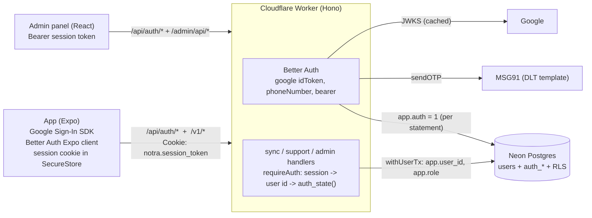
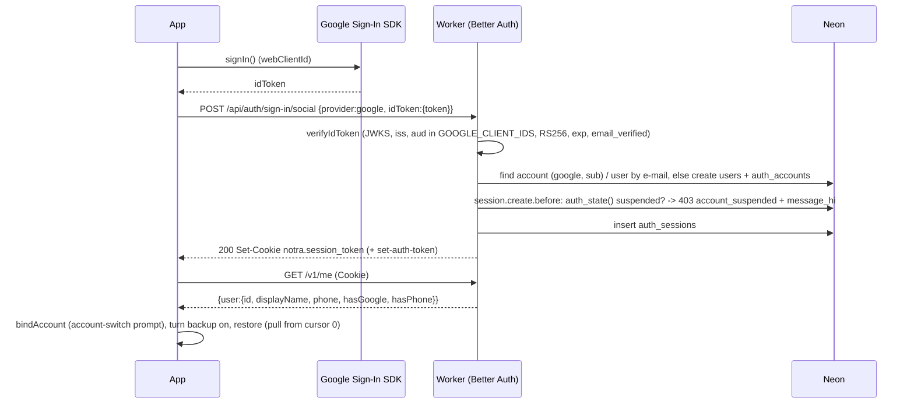
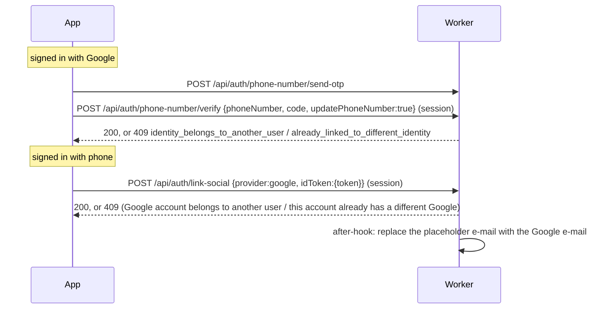
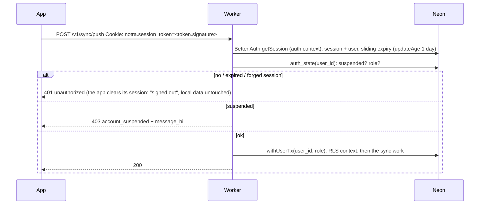

# Authentication (Better Auth, self-hosted in the Worker, on Neon Postgres)

Notra Book signs people in with **Google** or a **mobile OTP**. Sign-in is [Better Auth](https://better-auth.com) running **inside
our Cloudflare Worker**, against the **same Neon database** as everything else. This replaced the hand-written Google
ID-token + MSG91 OTP + own JWT/refresh-token code. There is exactly **one user system**: the `users` table.

* Neon project `winter-voice-10801980`, branch `production`.
* Code: `server/src/auth/` (Better Auth instance, Kysely dialect, OTP guard, error mapping, MSG91), `server/src/app.ts` (mount),
  `server/migrations/103_better_auth.sql`; app: `src/auth/` and `src/sync/runtime.ts`; admin panel: `admin/src/lib/api.ts`.

## 1. Research and decision

**User decision (overrides the original decision rule): self-host Better Auth in the Worker against the Neon database, with the plugins we
need. Do not use managed Neon Auth.** The research below is why that is a sound choice, not what made it.

### Managed Neon Auth (what we did *not* choose)

Neon Auth is "managed Better Auth": Better Auth run by Neon, with users, sessions, accounts and JWKS stored in a `neon_auth` schema in
your project. Findings, with the sources they came from:

| Question | Finding | Source |
| --- | --- | --- |
| Is it Better Auth? | Yes, managed Better Auth; data lives in the `neon_auth` schema of the same Postgres. | [Neon docs: Managed Better Auth](https://neon.com/docs/auth/overview) |
| Server-side JWT verification | Public JWKS at `<NEON_AUTH_URL>/.well-known/jwks.json`; a Worker can verify tokens with it. The token `sub` is `neon_auth.user.id`. | [Neon docs: JWT](https://neon.com/docs/auth/guides/plugins/jwt), [Authentication flow](https://neon.com/docs/auth/authentication-flow) |
| Joining our tables to its users | `neon_auth.user.id` can be a real foreign key / RLS identity, but the ids are **Neon's**, not our existing `users.id` uuids; every existing FK, RLS policy and the `users` table would have to be re-pointed or mapped (our inference from the above, not a Neon statement). | [Neon docs: Managed Better Auth](https://neon.com/docs/auth/overview) |
| Phone OTP | A `phone-number` plugin exists, but it is **sign-in only** (the user must already exist with a verified phone: no phone-first sign-up), the **OTP length is fixed at 6**, it needs a `send.otp` **webhook** to our SMS provider, and it limits `/phone-number/*` to 10 requests / 60 s / IP and 3 wrong codes. Sign-up by phone is exactly our main path. | [Neon docs: Phone Number](https://neon.com/docs/auth/guides/plugins/phone-number), [Webhooks](https://neon.com/docs/auth/guides/webhooks) |
| Native Google (ID token) and the Expo client | Better Auth itself supports `signIn.social({ provider: "google", idToken })` and has an Expo client; **whether the managed service exposes the ID-token path and the Expo plugin was not confirmed** (neon.com could not be fetched from this environment; only search snippets were available). | [Better Auth: Expo integration](https://better-auth.com/docs/integrations/expo) |
| Custom SMS sender (MSG91 for India DLT) | Possible only through the webhook above (we would host a webhook endpoint and keep OTP policy in someone else's service). | [Neon docs: Webhooks](https://neon.com/docs/auth/guides/webhooks) |

Not all four requirements (native Google, phone OTP with a custom provider **and** phone sign-up, Expo client, server-side JWT
verification) were confirmed, and the id mapping would have been a rewrite of the RLS layer. Together with the user's decision, that
settles it.

### Self-hosted Better Auth (what we built)

All of it works inside a Worker and was verified by tests in this repository:

| Need | How | Verified |
| --- | --- | --- |
| Phone OTP, our SMS sender | `phoneNumber` plugin (`otpLength: 6`, `expiresIn: 300`, `allowedAttempts: 5`, `signUpOnVerification`), `sendOTP` calls our `SmsProvider` (MSG91 with the DLT template, or the dev console provider) | `server/test/otp.test.ts` |
| Native Google | `socialProviders.google` with a custom `verifyIdToken` (our JWKS check: issuer, audiences = `GOOGLE_CLIENT_IDS`, RS256 only, expiry, verified e-mail); `POST /api/auth/sign-in/social {provider:"google", idToken:{token}}` | `server/test/auth.test.ts` (local JWKS) |
| Expo client | `@better-auth/expo` client plugin + `expo-secure-store`; the stored session cookie is also sent on our sync calls | `src/auth/__tests__/`, `npx expo export --platform android` |
| Bearer / cookie sessions | `bearer()` plugin (Authorization: Bearer `<signed session token>`, returned in `set-auth-token`) and the normal cookie | `auth.test.ts` |
| Workers + Neon | Kysely dialect over our own `Db` (the `postgres` driver per request, or pglite in tests); no `pg`, no second pool. `wrangler deploy --dry-run` bundles it (about 430 KiB gzipped); `nodejs_compat` is already on | dry-run, `driver.test.ts` over the real driver |
| Rate limiting | Better Auth's limiter with `storage: "database"` (`auth_rate_limits`) plus our per-phone / per-IP OTP limits | `otp.test.ts` |
| Account linking | Google and phone on one user: phone via `/phone-number/verify` with `updatePhoneNumber`, Google via `/link-social` with an ID token | `auth.test.ts` |

Better Auth is pinned at `^1.7.7`. A test (`server/test/migration.test.ts`) fails if a library upgrade starts using a column that migration 103
does not have.

### Why Neon Auth (`auth: true`) must stay OFF

Neon Auth would create a **second** user system (`neon_auth.user`, its own sessions, its own JWKS) next to ours. Two sets of ids for one
person is exactly how accounts get duplicated, deleted data survives in one of them, and RLS ends up trusting the wrong id. Our `users` table,
every foreign key, every RLS policy, suspension and staff roles all hang off one id. So:

* Do **not** add `auth: true` to `neon.ts` and do **not** run `neon deploy` with Neon Auth enabled for this project. If a `neon.ts` exists, leave
  auth off.
* Do **not** enable "Neon Auth" in the Neon console for project `winter-voice-10801980`.
* Neon is the database only. Better Auth lives in the Worker.

## 2. Architecture



### One user table

Better Auth's `user` model **is** our `users` table (`modelName: "users"`, same uuid ids; ids are generated with `crypto.randomUUID()`):

| Better Auth field | `users` column |
| --- | --- |
| `id` | `id` (uuid) |
| `name` | `display_name` (an empty name is stored as NULL) |
| `email` / `emailVerified` | `email` / `email_verified` |
| `image` | `image` |
| `createdAt` / `updatedAt` | `created_at` / `updated_at` |
| phone plugin `phoneNumber` / `phoneNumberVerified` | `phone_e164` / `phone_verified` |

Everything else in `users` (`status`, `suspended_*`, `signup_method`) is ours; Better Auth never writes it (it has no column privilege for it).

* **Google identity** lives in `auth_accounts` (`provider_id = 'google'`, `account_id` = the Google `sub`). A trigger keeps `users.google_sub` in
  step, so the admin panel and `publicUser()` still read `google_sub` / `phone_e164`.
* **Phone-only people** have no e-mail, but Better Auth needs one per user, so they get the placeholder `p91XXXXXXXXXX@phone.notra.invalid`
  (`.invalid` is reserved and undeliverable). The admin panel treats it as "no e-mail" (`real_email()` in SQL, `realEmail()` in TypeScript).
  Linking Google later replaces it with the real address.
* `signup_method` is set by a trigger (`phone` when the row is created with a phone number, otherwise `google`), so the analytics
  "new users by method" metric is unchanged.
* Better Auth's tables are `auth_sessions`, `auth_accounts`, `auth_verifications` (OTPs in flight), `auth_rate_limits`. The old
  `refresh_tokens` and `otp_requests` are dropped; `otp_events` (durable OTP telemetry), `blocklist`, `profiles.role` are unchanged.

### RLS and the auth library

Better Auth runs **before** a user id exists (sign-in, OTP verification), so `app.user_id` cannot be its context. Instead:

* `server/src/auth/dialect.ts` wraps **every** Better Auth statement in its own transaction that starts with
  `set_config('app.auth', '1', true)` (transaction-local, so it never leaks to the next request on a pooled connection).
* Migration 103 enables and forces RLS on the four `auth_*` tables with one narrow policy, `app_auth()`, for the runtime role, plus
  "own rows" policies on `auth_sessions` / `auth_accounts` (account deletion, force sign-out). On `users` it adds select / insert / update policies
  for `app_auth()` and column privileges limited to identity columns (`email_verified`, `image`, `phone_verified`, `updated_at`, plus the
  insert columns). `status`, suspension and roles stay behind the existing `SECURITY DEFINER` functions.
* Sync, admin and support code never set `app.auth`, so a bug there cannot read sessions, accounts, OTPs or rate-limit rows. (This is the same
  trust model as `app.user_id`: a GUC set by our code, inside our transaction.) There is **no separate database role** for auth; the one
  runtime role is enough because the gate is the policy, not a second credential. If you ever want a second role, give it `app_auth()`
  policies only and point `createAuth` at its own connection.
* Everything after sign-in is unchanged: `requireAuth` resolves the session to a user id, asks the database (`auth_state()`) whether the account
  is suspended and what staff role it has, then `withUserTx(userId, role, ...)` opens the RLS context. A suspended account gets
  `403 account_suspended` with `message_hi`; maintenance mode answers `503`; the admin role is always read from `profiles`.

## 3. Flows

### Google sign-in (native)



### Phone OTP sign-in (MSG91)

```mermaid
sequenceDiagram
  participant App
  participant W as Worker (Better Auth)
  participant DB as Neon
  participant SMS as MSG91
  App->>W: POST /api/auth/phone-number/send-otp {phoneNumber:+91...}
  W->>W: before-hook: normalise (+91, 10 digits), blocklist 403, limits (3/phone/15min, 10/IP/h, 30 s cooldown) + otp_events 'send'
  W->>DB: auth_verifications {identifier: phone, value: "code:0", expires +5 min}
  W->>SMS: sendOTP (DLT template) ; failure -> 502 sms_failed + otp_events 'send_fail'
  W-->>App: 200 {message:"code sent"}
  App->>W: POST /api/auth/phone-number/verify {phoneNumber, code}
  W->>DB: consume the row (atomic); wrong code: row re-created with attempts+1; >5 -> 429 too_many_attempts
  W->>DB: find user by phone_e164, else create (signUpOnVerification), phone_verified = true
  W->>DB: session.create.before (suspended? 403), insert auth_sessions
  W-->>App: 200 Set-Cookie + set-auth-token
  Note over W,DB: after-hook writes otp_events verify_ok / verify_fail
```

### Linking Google and phone to one account



### An authenticated request (sync, support, account delete)



### Sign-out, force sign-out, expiry

* App sign-out: `signOut()` -> `POST /api/auth/sign-out` deletes that session; the Expo plugin clears the stored cookie; local data is kept unless
  the person asks to clear it.
* Admin "Force sign-out" deletes **all** the person's `auth_sessions`: the phone gets `401` on its next request.
* Sessions last **60 days, sliding** (extended when used more than a day after the last extension). The app re-reads the session once a day
  so its locally stored expiry follows the server's. An expired session is `401`.
* Account deletion (`DELETE /v1/account`) removes sessions, linked sign-ins and the phone's OTP rows with the user, in one transaction.

### Admin panel

The panel uses the same endpoints from the browser: Google Identity Services ID token to `sign-in/social`, or `send-otp` / `verify`. The response
carries the signed session in `set-auth-token`; the panel keeps it in `sessionStorage` and sends `Authorization: Bearer`. The cookie is also set
(`credentials: include`, credentialed CORS for the exact `ADMIN_ORIGIN`), so a same-site deployment works with cookies alone. The role is read
from `profiles` on every request.

## 4. Endpoints

| Endpoint | Purpose |
| --- | --- |
| `POST /api/auth/sign-in/social` | Google (`{provider:"google", idToken:{token}}`); the redirect flow is refused (400) |
| `POST /api/auth/phone-number/send-otp` | send a 6-digit code (limits above) |
| `POST /api/auth/phone-number/verify` | sign in with the code; with `updatePhoneNumber: true` and a session: add the number to the account |
| `POST /api/auth/link-social` | add Google to the signed-in account |
| `POST /api/auth/sign-out` | end this session |
| `GET /api/auth/get-session` | the session (used by the Expo client to refresh its expiry) |
| `GET /v1/me` | `{user:{id, displayName, phone, hasGoogle, hasPhone}}` for the signed-in user |
| everything under `/v1/sync/*`, `/v1/support*`, `/v1/account`, `/admin/api/*` | require a session |

Disabled on purpose (404): e-mail/password sign-in and sign-up, password reset (including the phone plugin's), change e-mail / password, e-mail
verification. Error answers from `/api/auth/*` always carry `{ "error": "<snake_case>" }` (mapped in `server/src/auth/errors.ts`): `invalid_phone`,
`invalid_code`, `code_expired`, `too_many_attempts` (429), `resend_too_soon` (429, `Retry-After`), `too_many_requests` (429), `blocked` (403),
`sms_failed` (502), `invalid_google_token` (401), `identity_belongs_to_another_user` (409), `already_linked_to_different_identity` (409),
`account_suspended` (403 + `message_hi`), `maintenance` (503).

## 5. Security properties and limits

* **OTP**: 6 digits, 5 minutes, 5 wrong attempts then the code is gone (`429 too_many_attempts`), single use (atomic consume), the newest code wins.
  3 sends per phone per 15 minutes, 10 per IP per hour, 30 s resend cooldown, checked in SQL under a per-phone advisory lock (so concurrent requests
  cannot slip through); Better Auth's own limiter additionally allows 10 `/phone-number/*` calls per minute per IP (database-backed). The blocklist
  (`blocklist`) is checked on send **and** verify. `otp_events` records `send`, `send_fail`, `verify_ok`, `verify_fail`, `blocked` for the abuse and cost
  reports.
* **OTP at rest** (a change from the old design): the plugin stores the code **in clear** in `auth_verifications` for its 5 minutes (the old code stored a
  salted SHA-256). The table is closed to everything but the auth context, and the row is deleted on use. Accepting this keeps us on the library's
  tested path; moving to a hashed store would mean replacing `verifyOTP`.
* **Sessions** are random tokens stored server-side, so they can be revoked at once (sign-out, force sign-out, suspension, account deletion).
  The cookie / bearer value is `token.HMAC` signed with `BETTER_AUTH_SECRET`; a tampered value is `401`. Rotating the secret signs everyone out.
  `session.token` values are stored in clear in `auth_sessions` (library default).
* **Google tokens are never stored** (an account hook nulls `id_token`, `access_token`, `refresh_token`).
* **CSRF / origin**: `advanced.disableOriginCheck: false` is explicit. A cookie-authenticated POST must come from a trusted origin: the Worker's own
  origin, `notradiary://` (the Expo client sends `expo-origin`, which the Worker copies to `Origin`), and `ADMIN_ORIGIN`. Bearer clients send no cookie.
* **Cookie name**: `notra.session_token` over http, `__Secure-notra.session_token` over https (Better Auth adds the prefix when `BETTER_AUTH_URL` is https); the Expo client stores and replays whatever the server set.
* **No password anywhere**: password routes are disabled.
* Better Auth is initialised per request (about 2 ms warm); the instance and the database connection both live for one request.

## 6. Configuration

| Name | Where | Value |
| --- | --- | --- |
| `BETTER_AUTH_SECRET` | Worker secret (GitHub secret for the deploy workflow) | 32+ random characters, `openssl rand -base64 32` |
| `BETTER_AUTH_URL` | `server/wrangler.toml` `[vars]` | the Worker's public origin (`https://api.<domain>` or the `workers.dev` URL). It is Better Auth's base URL: cookie scope and trusted origin. A wrong value breaks cookie sessions and origin checks |
| `GOOGLE_CLIENT_IDS` | Worker secret | comma-separated OAuth client ids that may appear as the ID token audience: the **web** client id (the app's `extra.googleWebClientId`, which is the audience on Android) + android + ios + the admin panel's web client id |
| `DATABASE_URL` | Worker secret | restricted runtime role (`notra_runtime`, member of `notra_app`), **Neon pooled** connection string |
| `MIGRATION_DATABASE_URL` | GitHub secret (and local, for `npm run migrate`, `admin:bootstrap`) | the owner role, direct or pooled |
| `MSG91_AUTH_KEY`, `MSG91_TEMPLATE_ID` | Worker secrets | MSG91 auth key and the **DLT-approved** OTP template id (unchanged) |
| `SMS_PROVIDER` | Worker secret (optional) | `msg91` (default) or `dev` (logs the code; never in production) |
| `ADMIN_ORIGIN` | `wrangler.toml` var (optional) | exact origin of the admin panel when it is on another origin (CORS + trusted origin) |
| `SMS_COST_PAISE`, `ENVIRONMENT`, `SERVER_VERSION` | vars | unchanged |

**Removed:** `JWT_SECRET`, `OTP_PEPPER` (delete them from the Worker and from GitHub secrets once the new deploy works).

App config (`app.json`): `extra.apiUrl` = the Worker origin (same as `BETTER_AUTH_URL`), `extra.googleWebClientId`, `scheme: "notradiary"`
(must equal `APP_SCHEME` in `server/src/auth/better-auth.ts` and `src/auth/auth-api.ts`).

## 7. What you run (Neon, Google, MSG91)

Neon (project `winter-voice-10801980`, branch `production`). The Neon CLI was not available where this was built, so these steps are written from
the Neon docs and not executed here; the console shows the same values.

1. Link this checkout: `neon link --project-id winter-voice-10801980 --branch production`.
2. Connection strings: the **owner** role's string for migrations, and a **pooled** string for the runtime role (`neon connection-string --help` lists
   the branch / role / pooled flags for your CLI version; or Console > Dashboard > Connect, with *Connection pooling* on for the pooled one).
3. Migrate as the owner: `cd server && MIGRATION_DATABASE_URL='...' npm run migrate` (applies `103_better_auth.sql`; **everyone is signed out once**, their
   Google / phone identities and data carry over to the same user ids).
4. Create the runtime role once (see `docs/ADMIN.md` / `docs/DEPLOYMENT.md`): `CREATE ROLE notra_runtime LOGIN PASSWORD '<long random>' NOBYPASSRLS IN ROLE notra_app;`
   and use **its** pooled string as `DATABASE_URL`.
5. Secrets: `BETTER_AUTH_SECRET`, `DATABASE_URL`, `GOOGLE_CLIENT_IDS`, `MSG91_*` as Worker secrets or GitHub secrets for **Deploy server**; set
   `BETTER_AUTH_URL` in `server/wrangler.toml`. Remove `JWT_SECRET` and `OTP_PEPPER`.
6. **Keep Neon Auth off** (see section 1): no `auth: true` in `neon.ts`, nothing in the console.
7. Deploy (the **Deploy server** workflow or `cd server && npm run deploy`), set `extra.apiUrl` in `app.json` to the same origin, then ship a new app build
   (the app needs the Better Auth client and `expo-network` / `expo-web-browser`, which are native modules).
8. First owner: `npm run admin:bootstrap -- <phone or e-mail>` as before.

Google Cloud Console: the OAuth clients are unchanged (web, Android with the signing SHA-1s, iOS, admin web with the admin origin as an authorized
JavaScript origin); only make sure **every** client id whose tokens reach the server is in `GOOGLE_CLIENT_IDS`.

MSG91: nothing changes: the same auth key and DLT template. The template variable receives the 6-digit code; keep its text as approved.

## 8. App side

* `src/auth/client.ts` creates the Better Auth React client with `phoneNumberClient()` and `expoClient({ scheme, storagePrefix: "notra", cookiePrefix: "notra",
  storage })`, loaded lazily. The session cookie lives in expo-secure-store (`AFTER_FIRST_UNLOCK_THIS_DEVICE_ONLY`) under `notra_cookie`.
* `src/auth/auth-api.ts` wraps the client (`signInGoogle`, `otpStart`, `otpVerify`, `linkGoogle`, `linkPhone`, `signOut`, `refreshSession`) and maps errors to
  the `HttpError` / `SuspendedError` the screens already show in Hindi. Unit tested with a fake client.
* `src/sync/http.ts` sends `Cookie: <authClient.getCookie()>` on authenticated calls; a `401` clears the session and raises `SignedOutError`
  (no refresh logic any more: the server extends the session itself).
* Sign-in order is unchanged: session created -> `GET /v1/me` -> **account-switch prompt** (`bindAccount`) -> backup on -> restore. A
  `signin_pending` marker means that if the app dies while the prompt is open, the new session is discarded on the next start instead of being used
  to sync another account's data. Cancelling signs the new session out on the server.
* Suspended accounts: `403 account_suspended` (sign-in or any call) -> `SuspendedError` with the server's Hindi text; local use continues.
* "बाद में" (skip) and offline use are untouched: nothing in the app needs a session except sync / support / config-with-auth.

## 9. Tests

* `server/test/auth.test.ts` (Google with a local JWKS, several client ids, rejects, sessions, cookie, sign-out, expiry, CSRF, linking, RLS closure),
  `otp.test.ts` (happy / wrong / expired / attempt limit / rate limits / cooldown / concurrency / SMS failure / telemetry),
  `migration.test.ts` (upgrade of an existing database, schema drift guard), plus the RLS, admin, ops, sync, account and driver (real `postgres`
  driver over pglite-socket) suites, all signing in through Better Auth.
* `src/auth/__tests__/auth-api.test.ts`, `src/sync/__tests__/http.test.ts` (app), `admin/src/lib/api-auth.vtest.ts` (admin).

## 10. Known limits and unverified

* **Not run against real Neon, Google, MSG91, or a real Cloudflare Worker / device** in this environment: the Worker bundles (`wrangler deploy --dry-run`) and
  everything runs against pglite and the real `postgres` driver over the wire protocol, but a live end-to-end sign-in is yours to smoke-test (docs/DEPLOYMENT.md).
* The Expo client was typechecked, bundled for Android and its wrapper unit-tested, but not exercised on a device.
* Per-request cost: each authenticated call now costs a session lookup (two statements, each in its own transaction) before `auth_state`. Fine on Neon pooled
  in-region; if latency matters, put Hyperdrive in front (supported by `worker.ts`) or add a short signed cookie cache (it would delay revocation).
* The OTP is stored in clear for 5 minutes (section 5).
* Old stale code: `server/src/auth/otp.ts` and `tokens.ts` are no longer imported by anything and should be deleted (`git rm`).

## 11. Follow-ups (deferred)

* Delete the dead `server/src/auth/otp.ts` and `server/src/auth/tokens.ts` (`git rm`; nothing imports them; the tool environment refused the deletion). `server/src/crypto.ts` helpers `randomToken`, `randomCode6`, `safeEqual` are then only used by tests.
* Live smoke test on real Neon / Google / MSG91 / a device (section 7 and DEPLOYMENT.md); set the real `BETTER_AUTH_URL` in `server/wrangler.toml` (it ships as a placeholder).
* Make the SMS provider lazy so a missing MSG91 secret does not 500 every route (ROADMAP item 3, unchanged).
* Optional: hash the OTP at rest (replace `verifyOTP`), a signed session cookie cache or Hyperdrive for lower per-request latency, an auth-only database role, exempting staff sign-in from maintenance mode.
* One server test was seen failing once under heavy parallel load (passed on 4 re-runs); if it recurs, suspect the time-based OTP rate-limit tests.
