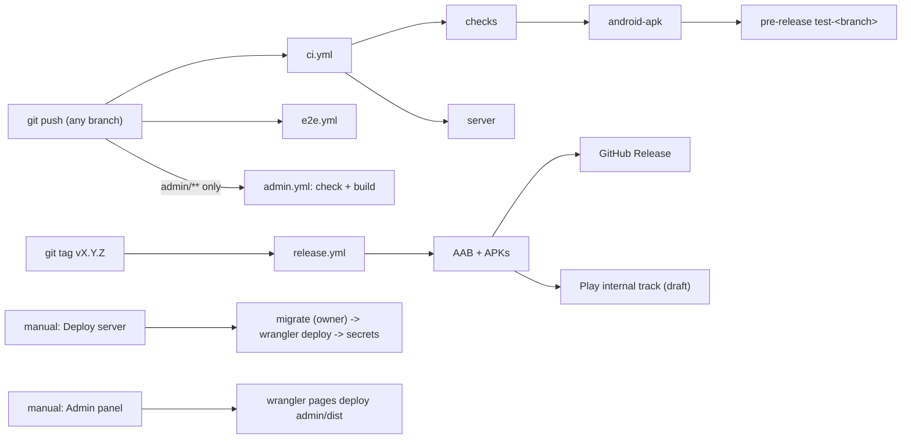

# CI/CD

All automation is GitHub Actions in `.github/workflows/`. Nothing deploys automatically from a push: production changes
(Worker, admin site, Play) are manual or tag-triggered. See [DEPLOYMENT.md](DEPLOYMENT.md) for first-time setup and
[RELEASE.md](RELEASE.md) for the signing / Play walkthrough.

## 1. Workflows

### 1.1 `ci.yml` (name: CI)

| Item | Value |
| --- | --- |
| Triggers | push to **any** branch, PR to `main`, manual |
| Concurrency | `ci-${{ github.ref }}`, newer run cancels the older one |
| Env | ccache settings below |

Jobs:

| Job | Needs | What it does | Time (typical) |
| --- | --- | --- | --- |
| `checks` | none | Node 22 (npm cache), `npm ci`, `npm run typecheck`, `npm run lint`, `npm test` | 2-4 min |
| `server` | none | in `server/`: `npm ci`, `npm run typecheck`, `npm test` (vitest + PGlite) | 2-4 min |
| `android-apk` | `checks` | JDK 17, Gradle cache (`gradle/actions/setup-gradle@v4`, `cache-read-only: false`), ccache (`key: ccache-<job>`, `max-size: 2G`), `npm ci`, `expo prebuild --platform android --no-install` with `CI=1 NOTRA_ADS_TEST=1`, `./gradlew assembleRelease --no-daemon --build-cache --parallel`, upload artifact, print APK size; on **push only** publish the pre-release | cold 25-40 min, warm 8-15 min (timeout 60) |

The APK is a **release build signed with the debug keystore** (no upload secrets here): installable for testing, **not** uploadable to Play.
Proguard minification and resource shrinking are on; ABIs `armeabi-v7a` + `arm64-v8a` (`app.json`).

**Artifact**: `notra-book-apk` (`android/app/build/outputs/apk/release/*.apk`).

**Test pre-release** (push only, `contents: write`): `TAG = test-<branch with / replaced by ->`; the job deletes the previous release and tag
(`gh release delete "$TAG" --cleanup-tag --yes || true`), copies the APK to **`notra-book-test.apk`**, and creates a **pre-release** targeting the commit.
Direct download URL printed in the log:
`https://github.com/<owner>/<repo>/releases/download/test-<branch>/notra-book-test.apk`. Open that link on the Android phone and install
(allow "install unknown apps"). Each push to a branch replaces that branch's test build.

### 1.2 `e2e.yml` (name: E2E)

| Item | Value |
| --- | --- |
| Triggers | push to any branch, manual; concurrency `e2e-${{ github.ref }}` (cancel in progress) |
| Timeout | 75 min |
| Env | `NOTRA_ADS_TEST=1`, `NOTRA_ADS_E2E=1` at prebuild (banners/native cards appear because the app pretends it was installed 2 days ago; full-screen ads off) |

Steps: checkout, Node 22, JDK 17, Gradle cache, ccache, `npm ci`, prebuild, free runner disk (removes dotnet, ghc, boost, CodeQL), build an
**x86_64** release APK (`-PreactNativeArchitectures=x86_64`), drop native intermediates (keeps the APK), enable KVM, install Maestro, restore
AVD cache (`avd-api30-x86_64-pixel_4-v1`), create the AVD snapshot on a cache miss, then run
`reactivecircus/android-emulator-runner@v2` (API 30, `google_apis`, x86_64, `pixel_4`, `-no-window -gpu swiftshader_indirect`, animations disabled)
executing `bash scripts/e2e-run.sh "$APK"`.

`scripts/e2e-run.sh` installs the APK, clears logcat, runs `maestro test .maestro/ --format junit --output report.xml`, **always** dumps
`logcat.txt` and a final screenshot, and exits with Maestro's status.

Flows (`.maestro/config.yaml` fixes the order, they share app state, only 01 clears it): 01 launch/setup, 02 add household, 03 search, 04 मेरा नोतरा
(receive only), 05 दूसरों का नोतरा (give, उतार/चढ़ाव), 06 पुराना हिसाब, 07 reports + photo send, 08 persistence after kill, 09 screenshots (no assertions).
`continueOnFailure: true`, so one failure does not hide the others. **Note** [TESTING.md](TESTING.md) still describes the older 7-flow set; trust
`.maestro/config.yaml`.

Time: cold ~35-60 min, warm ~20-35 min (x86_64 build + emulator boot dominate).

### 1.3 `release.yml` (name: Release)

| Item | Value |
| --- | --- |
| Triggers | tag `v*`, manual (any branch; no GitHub Release without a tag) |
| Permissions | `contents: write` |
| Env | `NOTRA_VERSION_CODE = github.run_number`, `HAS_KEYSTORE`, `HAS_PLAY` (are the secrets non-empty) |

Steps: setup as above, `npm ci`, **quality gates** (typecheck, lint, test), decode the keystore to `$RUNNER_TEMP/upload.jks` when
`ANDROID_KEYSTORE_BASE64` exists (else warn: debug-signed), `expo prebuild` with the four `NOTRA_UPLOAD_*` values and the AdMob variables
(`NOTRA_ADS_TEST` = `0` only when a keystore exists, otherwise `1`), `./gradlew bundleRelease assembleRelease --no-daemon --build-cache --parallel`,
verify the APK signature with `apksigner`, upload artifacts **`notra-book-aab`** and **`notra-book-apks`**, attach APKs to a GitHub Release (tags only,
generated notes), and, only when both `PLAY_SERVICE_ACCOUNT_JSON` and the keystore exist, upload the AAB to Play **internal** track as a **draft**
(`r0adkll/upload-google-play@v1`, package `app.notra.book`).
Time: 25-45 min.

### 1.4 `deploy-server.yml` (name: Deploy server)

Manual only. Working directory `server/`. Steps: `npm ci`, `npm run typecheck`, `npm test`, **`npm run migrate`** (env `MIGRATION_DATABASE_URL`, the OWNER role),
**`npm run deploy`** (`wrangler deploy`, env `CLOUDFLARE_API_TOKEN`, `CLOUDFLARE_ACCOUNT_ID`), then **set Worker secrets** with `wrangler secret put` for each
non-empty one of `DATABASE_URL BETTER_AUTH_SECRET GOOGLE_CLIENT_IDS SMS_PROVIDER MSG91_AUTH_KEY MSG91_TEMPLATE_ID` (values piped, never printed).
Order matters: migrations first so the new Worker finds its schema; secrets after the first deploy because `wrangler secret put` needs the Worker to exist
(on a first ever deploy the Worker answers 500 until the secrets are set). `[vars]` (`ENVIRONMENT`, `SMS_COST_PAISE`) come from `wrangler.toml`; `ADMIN_ORIGIN`
and `SERVER_VERSION` are not set by this workflow. `BETTER_AUTH_URL` is a plain var in `wrangler.toml`; auth details: `docs/AUTH.md`.

### 1.5 `admin.yml` (name: Admin panel)

Push touching `admin/**` or the workflow file: `check` job (`npm ci`, typecheck, lint, test, `npm run build` with `VITE_API_BASE` and
`VITE_GOOGLE_CLIENT_ID` from repository **variables** `ADMIN_API_BASE`, `ADMIN_GOOGLE_CLIENT_ID`, bundle size report, artifact `admin-dist` for 7 days).
Manual run with input `deploy` (default true): after `check`, the `deploy` job downloads `admin-dist` and runs
`npx wrangler@4 pages deploy admin/dist --project-name notra-admin` (secrets `CLOUDFLARE_API_TOKEN`, `CLOUDFLARE_ACCOUNT_ID`). The Pages project `notra-admin` must exist.
`admin/public/_redirects` (`/* /index.html 200`) gives SPA routing. Time: 1-3 min.

## 2. Caches

| Cache | Mechanism | Setting | Why |
| --- | --- | --- | --- |
| npm | `actions/setup-node` `cache: npm` (`cache-dependency-path` for `server/` and `admin/`) | | fast installs |
| Gradle | `gradle/actions/setup-gradle@v4`, `cache-read-only: false`, plus `--build-cache --parallel` | writes on every branch | dependency + task cache |
| ccache | `hendrikmuhs/ccache-action@v1.2`, `key: ccache-${{ github.job }}`, `max-size: 2G` | | reuses compiled C/C++ (React Native, SQLCipher, reanimated) |
| AVD | `actions/cache@v4` on `~/.android/avd/*`, key `avd-api30-x86_64-pixel_4-v1` | bump `v1` to rebuild | emulator snapshot |

ccache env (set in `ci.yml`, `e2e.yml`, `release.yml`): `CMAKE_C_COMPILER_LAUNCHER=ccache`, `CMAKE_CXX_COMPILER_LAUNCHER=ccache`,
`CCACHE_BASEDIR=${{ github.workspace }}`, `CCACHE_NOHASHDIR=true`, `CCACHE_COMPILERCHECK=content`,
`CCACHE_SLOPPINESS=pch_defines,time_macros,include_file_mtime,include_file_ctime,file_macro,system_headers`.
The point: Android CMake builds use per-build absolute paths; base dir + no-hash-dir + sloppiness let the cache hit across runs (commit `18d1706`).
Cache is keyed by job name, so `android-apk`, `maestro` and `release` have separate ccaches. Caches are scoped to branches by GitHub (a new branch
falls back to the default branch cache), so a brand new branch starts slow.

## 3. Secrets and variables

| Name | Kind | Used by | Required |
| --- | --- | --- | --- |
| `GITHUB_TOKEN` | automatic | pre-release, releases | yes (automatic) |
| `ANDROID_KEYSTORE_BASE64`, `ANDROID_KEYSTORE_PASSWORD`, `ANDROID_KEY_ALIAS`, `ANDROID_KEY_PASSWORD` | secret | release | for a Play-signed build |
| `PLAY_SERVICE_ACCOUNT_JSON` | secret | release | optional (skips upload when empty) |
| `ADMOB_ANDROID_APP_ID`, `ADMOB_BANNER_ID`, `ADMOB_NATIVE_ID`, `ADMOB_INTERSTITIAL_ID`, `ADMOB_REWARDED_ID` | secret | release (-> `EXPO_PUBLIC_ADMOB_*`) | for real ads |
| `MIGRATION_DATABASE_URL` | secret | deploy-server | yes (owner role) |
| `DATABASE_URL` | secret | deploy-server (set as Worker secret) | yes (restricted runtime role) |
| `BETTER_AUTH_SECRET`, `GOOGLE_CLIENT_IDS`, `SMS_PROVIDER`, `MSG91_AUTH_KEY`, `MSG91_TEMPLATE_ID` | secret | deploy-server -> Worker secrets | yes (see `docs/AUTH.md`; `JWT_SECRET` and `OTP_PEPPER` are retired) |
| `CLOUDFLARE_API_TOKEN`, `CLOUDFLARE_ACCOUNT_ID` | secret | deploy-server, admin | yes |
| `ADMIN_API_BASE`, `ADMIN_GOOGLE_CLIENT_ID` | repository **variables** | admin build | when the admin site and API are on different origins / Google login wanted |

`google-services.json` is committed, so no Firebase secret exists. See [SECURITY_PRIVACY.md](SECURITY_PRIVACY.md) section 13.

## 4. Debugging failures

1. **Open the failing run** in the Actions tab, expand the failing step, read the first error (not the last line). Re-run with "Re-run failed jobs".
2. `checks`/`server` red: reproduce locally with the same commands (`npm ci && npm run typecheck && npm run lint && npm test`; `cd server && npm ci && npm test`).
   Node must be 22.
3. `android-apk` red: usual causes are `expo prebuild` plugin errors (config in `app.json`/`app.config.js`, plugin `withReleaseSigning` throws
   loudly if the Gradle template changed), a missing `google-services.json`, out-of-memory in Gradle, or the 60-minute timeout on a cold cache.
   Try the **Gradle/ccache state**: first run on a new branch is cold.
4. `e2e` red: download artifacts **`e2e-screenshots`** (screens per step plus `~/.maestro/tests/**` with the failing frame and `commands-*.json`),
   **`e2e-report`** (`report.xml`, JUnit) and **`e2e-logcat`** (`logcat.txt`; search `ReactNativeJS`, `AndroidRuntime`, `FATAL`). Typical causes: a changed
   label or `testID`, the first-run flow (picture cards, sign-in `बाद में`), a slow emulator (`extendedWaitUntil` timeouts), the ad banner covering a button.
   Locally: `maestro studio` against a phone or emulator.
5. `release` red at "Verify signature"/Play: check the four keystore secrets (empty value = debug-signed, which Play rejects) and the service account
   permission (*Release to testing tracks*). The very first AAB must be uploaded manually once in Play Console.
6. `deploy-server` red: migration failure (owner URL wrong, a migration needs a role that does not exist) leaves the Worker un-deployed (good). A failure in
   "Set Worker secrets" leaves the new code live with old secrets: re-run.
7. CI cancelled: `cancel-in-progress` cancels older runs of the same ref on a new push. Not a failure.

## 5. Cutting a Play release

Full detail in [RELEASE.md](RELEASE.md). Short version:

1. One-time: create the upload keystore, add the four `ANDROID_*` secrets, create the app in Play Console (`app.notra.book`), complete declarations
   ([PLAY_STORE.md](PLAY_STORE.md)), upload the first AAB manually, and (optionally) add `PLAY_SERVICE_ACCOUNT_JSON`. Add the five `ADMOB_*` secrets only
   when the real AdMob app and units exist.
2. Make sure `main` is green (CI + E2E), the Worker/DB are already migrated (deploy server **first** for any API/schema change).
3. Bump `expo.version` in `app.json` when the user-visible version changes (the app and admin compare it with `min_supported_version` / `latest_version`).
4. `git tag v1.0.1 && git push --tags`. Watch **Release**. `versionCode = run_number` (raise the offset in `release.yml` if Play already has a higher code).
5. Promote the draft in Play Console (internal -> closed/open -> production). Install the build on a real low-end phone from the Play internal link
   and run the smoke test in [LAUNCH_CHECKLIST.md](LAUNCH_CHECKLIST.md).
6. Only after the new build is live and adopted, consider raising `min_supported_version` in the admin Remote config.
