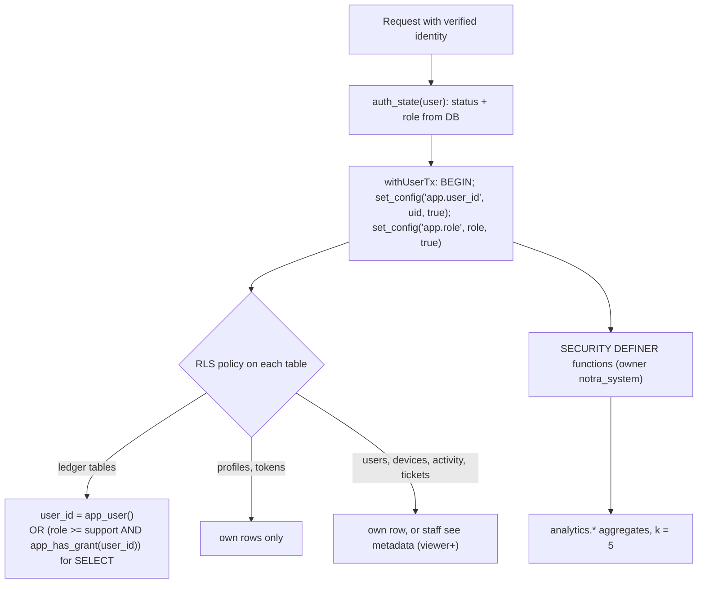

# Security and privacy

Notra holds *who gave how much to whom inside a village*. One leak ends the product. The design therefore keeps the diary on the
phone, makes the cloud copy opt-in, and makes it technically impossible (in the database, not just the API) for staff to read it.

Related: [ADMIN.md](ADMIN.md) (staff panel and runbooks), [PLAY_STORE.md](PLAY_STORE.md) (Data Safety answers), [ADS.md](ADS.md),
[DEPLOYMENT.md](DEPLOYMENT.md). Authentication internals (sign-in, sessions, OTP) are documented in `docs/AUTH.md`
(Google + mobile OTP via Better Auth on Neon); this page only states what the rest of the system relies on.

## 1. Threat model

| # | Threat | Mitigation (where) | Residual risk |
| --- | --- | --- | --- |
| T1 | Lost / stolen phone, someone opens the app | optional app lock PIN, per-ledger PINs, DB encrypted with SQLCipher; key in Android Keystore (`src/db/key.ts`) | a 4-digit PIN is guessable; real protection is encryption + attempt back-off. No PIN by default |
| T2 | Someone with file access to the phone (rooted, adb backup) | SQLCipher DB; tokens in secure store; `AFTER_FIRST_UNLOCK_THIS_DEVICE_ONLY` | rooted device with live process can read memory |
| T3 | Stolen backup file | scrypt + XChaCha20-Poly1305 with header as AAD (`src/backup/crypto.ts`) | weak password (only 6 characters minimum) |
| T4 | Another user reads my cloud data | `user_id` in every key and query + **Row Level Security** forced on every user table | a compromised Worker could set `app.user_id` (see 7) |
| T5 | Staff reads diaries | no policy lets any staff role read other users' ledger rows; only a **user-created, <= 7-day, read-only grant** opens it; every read audited; response privacy guard | consented viewing is by design |
| T6 | Staff or analytics re-identify small groups | k-anonymity (k = 5) in SQL aggregate functions | differencing overlapping totals (documented limit) |
| T7 | Self-promotion to admin | runtime role has no `UPDATE` on `profiles.role` / `users.status`; roles change only via `staff_set_role()` (owner only, last owner protected) | owner account compromise |
| T8 | SMS-cost abuse / OTP guessing | SQL rate limits, attempt limits, blocklist, durable `otp_events` + admin Abuse page | distributed abuse needs Cloudflare rate-limit rules |
| T9 | Ads / analytics leak diary data | no ledger data passed to AdMob; Firebase events limited to a closed allow-list + sanitizer | SDKs still collect their own device data |
| T10 | Man-in-the-middle | HTTPS only (Workers) | no certificate pinning |
| T11 | Hostile backup file / sync payload | strict validators, scrypt parameter caps (`N <= 2^16`), size caps | |
| T12 | Account takeover via phone number recycling | not mitigated beyond OTP | accepted for now |
| T13 | Server-side data breach (DB provider) | RLS, restricted role; cloud copy is **not** end-to-end encrypted | provider/DB-owner access can read data |

## 2. On-device encryption

- The database is opened with `PRAGMA key = "x'<64 hex>'"` as the first statement (`src/db/database.ts`); `useSQLCipher: true` is set in
  the `expo-sqlite` plugin entry in `app.json`.
- The key is 256 random bits from `expo-crypto`, generated once and stored with `expo-secure-store` under `notra_diary_db_key_v1`
  (`AFTER_FIRST_UNLOCK_THIS_DEVICE_ONLY`: not restored to another device). **If the key is lost the data is unrecoverable on that phone**
  (this is why the cloud copy and the backup file exist).
- **Expo Go ships plain SQLite**: the pragma is a no-op there, so the DB is *not* encrypted in Expo Go. Test encryption only in a
  native build (CI APK or a development build).
- Photos are local files (resized to 512 px) and are **not** encrypted by SQLCipher.

## 3. Backup file cryptography (`src/backup/crypto.ts`)

| Item | Value |
| --- | --- |
| Format | JSON text, `format: "notra-backup"`, `v: 1`, file name `notra-backup-YYYY-MM-DD.notra` |
| KDF | scrypt, `N = 2^15, r = 8, p = 1`, 32-byte key, 16-byte random salt, password NFKC-normalised. Parameters stored in the file; on restore `N` must be a power of two in `2^10..2^16`, `r 1..8`, `p = 1` so a hostile file cannot exhaust memory |
| Cipher | XChaCha20-Poly1305, 24-byte random nonce |
| AAD | `format|v|kdf|N|r|p|salt|cipher|nonce`: the header cannot be altered without failing decryption |
| Errors | `not_a_backup`, `unsupported`, `wrong_password_or_damaged`, `invalid_data` (Hindi text in `BACKUP_ERROR_HI`) |
| Content | chosen ledgers (without a PIN or with the PIN entered this session), families, events, entries, profile. **Never** PINs, hashes, photos, voice |
| Libraries | `@noble/ciphers`, `@noble/hashes` (pure JS, audited, no native module) |

Minimum password length is `MIN_PASSWORD_LENGTH = 6`. Restore merges (entries insert-or-ignore) and never overwrites newer data.

## 4. PIN hashing (`src/core/pin.ts`)

`pbkdf2-sha256$10000$<salt hex>$<hash hex>`, 16-byte salt, constant-time compare, iteration count stored with the hash so it can be
raised later. Back-off after the third wrong try: 30 s, 60 s, 5 min, 15 min, 1 h (repeats), persisted in `settings` so a restart does
not reset it. PINs are local only. The code documents the honest limit: 10,000 possible values; the SQLCipher encryption and the
back-off are the real protection.

## 5. Authentication and sessions (high level)

- Sign-in methods: **Google** and **mobile OTP**, both via Better Auth on Neon (see `docs/AUTH.md` and ADR-021 in
  [DECISIONS.md](DECISIONS.md)). Staff use the same sign-in as users.
- On the phone, credentials live only in the OS keystore via `expo-secure-store` (`src/auth/session.ts`), never in SQLite or logs.
- Every authenticated request, in the app and the admin API, re-reads **account status (suspended?) and staff role from the
  database** (`auth_state`), never from the token or the request body. Suspension and demotion therefore take effect on the next request.
- The access-control model below does not depend on how sessions are issued, only on the Worker calling `withUserTx(db, userId, role, ...)`
  with a database-derived role.

## 6. Postgres Row Level Security (migration `101_rls.sql`)

- **Roles.** Migrations (and `scripts/migrate.mjs`, `scripts/admin-bootstrap.mjs`) run as the **table owner**
  (`MIGRATION_DATABASE_URL`). The Worker connects as a **LOGIN role that is a member of `notra_app`** (`DATABASE_URL`), with
  `NOBYPASSRLS`, owning nothing. `notra_system` is `NOLOGIN`; the runtime role cannot `SET ROLE` to it. Verify with
  `SELECT rolbypassrls FROM pg_roles WHERE rolname = '<runtime role>'` (must be `f`).
- **`withUserTx`** (`server/src/db.ts`): every request that touches user data runs in ONE transaction that starts with
  `set_config(..., true)` (transaction-local, so nothing leaks to the next request on a pooled connection). Outside it the context is
  empty and RLS returns **no rows**. Forgetting it is the classic bug: queries "work" in tests as superuser and return nothing in production
  (the test helper runs every statement as `notra_app` for exactly this reason).
- **Forced RLS** (`ENABLE` + `FORCE`) on `users, households, events, entries, ledgers, profiles, user_devices, user_activity_daily,
  support_tickets, ticket_notes, user_notes, support_access_grants`, plus Better Auth's `auth_sessions, auth_accounts, auth_verifications, auth_rate_limits`
  (open only to the auth context `app.auth = '1'`, which only `server/src/auth/dialect.ts` sets; see `docs/AUTH.md`). A test fails if a table with a `user_id` column is not
  forced. New user-data tables must be added in a new `1xx_*.sql` migration with policies.
- **Column privileges**: `UPDATE` on `users` limited to identity columns (no `status`); `profiles.role` not writable;
  `admin_audit_log` has no `UPDATE`/`DELETE` for the app; `daily_stats` cannot be written by the app.
- **`SECURITY DEFINER` functions** (owner `notra_system`, `search_path` pinned, `EXECUTE` revoked from `PUBLIC` and granted to
  `notra_app`): `auth_state`, `admin_user_counts`, `admin_active_sessions`, (four integers), `admin_set_user_status`, `admin_force_signout`, `admin_delete_user`, `staff_list`,
  `staff_set_role` (owner; last owner protected), `admin_migration_version`, `app_has_grant`, and the `analytics.*` functions. Each privileged
  one calls `app_require_role(...)` itself in addition to the API gate. (Some of these belong to the pre-Better-Auth sign-in and will change
  with it; see `docs/AUTH.md`.)
- Unprotected by RLS on purpose: pre-sign-in or non-user tables keyed by phone/IP or global (`otp_events`, `blocklist`, `app_config`,
  `config_history`, `error_log`, `daily_stats`, `admin_audit_log`, `account_deletions`). `schema_migrations` is revoked from the app role.

## 7. Consented support access

A user can let support read their data, **read-only, for at most 7 days**, from the app (Settings "सहायता को मेरा डेटा दिखाएं",
`src/app/support-access.tsx`). The server creates a row in `support_access_grants` (only the user can insert it, `CHECK expires_at <=
granted_at + 7 days`, revocable at once). While active, the ledger `SELECT` policy lets `support`, `admin`, `owner` read **that user's**
rows. Staff open **Users > user > data the user chose to share**, which calls the only admin endpoint that can return ledger fields
(`/admin/api/support-view/:userId/:table`): it refuses without a grant (403 `no_active_grant`), is read-only, and **writes an audit row**
(`support_data_view`, table + row count, never data).

> Known mismatch (found while documenting): the app's request shape for grant/revoke does not match the server's. See
> [ROADMAP.md](ROADMAP.md) "Known limitations" item 1.

## 8. K-anonymity analytics (`102_analytics.sql`)

Staff dashboards read only `analytics.*` functions and the `daily_stats` table. Every group built from fewer than `analytics.k() = 5`
distinct users comes back `NULL` with `suppressed = true` (the API prints `"<5"`). Regions list only villages with 5+ users and one
`<5` bucket for the rest; district is not derivable and not shown. Amount distributions use buckets (Rs 0-100, 101-500, 501-1000,
1001-5000, 5000+) over **effective entries** (not voided, not superseded). Known limit: differencing two overlapping totals can narrow a
small group; do not add finer functions (per village per day) without re-checking.

## 9. Admin audit log and privacy guard

- `admin_audit_log` records who, role, action, target, reason, IP, and before/after **metadata** for every mutation, every unmask and every
  consented read. `before_meta`/`after_meta` are passed through `stripForbidden`. The row is written in the same transaction as the action;
  an error rolls both back.
- **Response privacy guard** (`server/src/admin/privacy.ts`, applied in `admin/api.ts`): if any key from `FORBIDDEN_KEYS` (names, villages,
  amounts, directions, household phone, ...) appears in an admin response, the transaction is rolled back and the answer is `500
  privacy_guard`. The support-view route is the single exemption. `server/test/admin.test.ts` walks every registered route against it.
- User identifiers are masked in the panel (`mask.ts`: `+91 98•••••210`, `g•••@gmail.com`); **unmask** needs `admin`, a reason, and is audited.

## 10. Permissions and what the app can see

`app.json` declares `RECORD_AUDIO` (speak to write, only on tap) and `CAMERA` (family photo, only on tap). Explicitly **blocked**:
`READ_CONTACTS`, `READ_SMS`, `READ_CALL_LOG`, `READ_EXTERNAL_STORAGE`, `WRITE_EXTERNAL_STORAGE`, `READ_MEDIA_IMAGES/VIDEO/AUDIO`,
`MANAGE_EXTERNAL_STORAGE`, `SYSTEM_ALERT_WINDOW`. Added by libraries: `INTERNET`, `ACCESS_NETWORK_STATE`, `WAKE_LOCK`, and
`com.google.android.gms.permission.AD_ID` (AdMob).

**Contacts without READ_CONTACTS**: `modules/notra-contact-picker` fires `ACTION_PICK` on `Phone.CONTENT_URI`. The system picker (another
app) returns the ONE tapped row with a temporary read grant for that URI; the module queries only that URI for name and number. The number is
normalised to +91 (`core/phone.ts`). The module exists only in the Android build.

## 11. What ads and analytics may and may not receive

| | AdMob (`src/ads`) | Firebase Analytics (`src/analytics`) |
| --- | --- | --- |
| May receive | ad requests with `maxAdContentRating = PG`, not child-directed, not under-age; non-personalised until UMP resolves; Google's own device data (advertising ID) | closed allow-list events: screen route templates (`/events/[id]`, never real ids), `entry_saved {side, has_in_kind, payment_mode}`, `report_exported {report, format, pages bucket}`, `sign_in {method}`, etc. (`src/analytics/events.ts`) |
| Never receives | names, villages, phones, amounts, items, labels, notes, search text, ids, keywords, content URLs | the same; plus no user id and no user properties; strings > 40 chars or with 4+ digits in a row are refused by the sanitizer |
| Consent | Google UMP (form only where required) | Settings switch (default on) AND remote `features.analytics` AND not blocked by UMP; `firebase.json` defaults all collection/ad signals to off until runtime consent |
| Never shown on | event ledger, entry forms, keypad, PIN/lock, onboarding, sign-in, settings, legal, backup, account deletion, error screens | n/a |

The Firebase API key in `google-services.json` is **not a secret** (it ships in every APK) but must be restricted in Google Cloud Console
(Android app restriction with package `app.notra.book` and every signing SHA-1; API restriction to the Firebase APIs actually used).

## 12. DPDP Act 2023 and Play obligations

| Obligation | Status | Where |
| --- | --- | --- |
| Privacy policy and terms at public URLs | served by the Worker `/privacy`, `/terms`; text from `src/legal/content.ts` (placeholders in `CONTACT`: owner must fill) | `server/src/pages.ts` |
| Grievance officer, 30-day response | page `/grievance`; tickets with `due_at` = +30 days, SLA report and red overdue marking in admin | `support.ts`, admin Tickets |
| Account deletion in-app and on the web | Settings "खाता हटाएं" -> `DELETE /v1/account` (one transaction, idempotent); page `/delete-account`; admin can delete on request | `account.ts`, `admin_delete_user` |
| Data minimisation | no contacts/SMS/call log/location; cloud copy only if the user signs in | `app.json`, sync design |
| Consent for ads / analytics | UMP; analytics opt-out switch; first-day ad-free | `src/ads`, `src/analytics` |
| Play Data Safety form | answers in [PLAY_STORE.md](PLAY_STORE.md) | owner must submit |
| No children targeting | ads rated PG, not child-directed; policy text says under 18 not targeted | `src/ads/service.ts` |
| Do not claim "encrypted at rest" for the server copy unless the DB provider setting is verified | in PLAY_STORE.md | owner |

Tickets survive account deletion (the link to the account is cleared) as the grievance record; the privacy text should say so and
mention provider backup retention (not yet added; see [LAUNCH_CHECKLIST.md](LAUNCH_CHECKLIST.md)).

## 13. Secrets: what exists and where it lives

| Secret / identifier | Where it lives | Notes |
| --- | --- | --- |
| `DATABASE_URL` (restricted runtime role) | Worker secret (set by `deploy-server.yml` from a GitHub secret) | never the owner role |
| `MIGRATION_DATABASE_URL` (owner role) | GitHub Actions secret only | migrations, `admin:bootstrap` |
| Session signing secret (`BETTER_AUTH_SECRET`) | Worker secret | see `docs/AUTH.md`; rotate = everyone signs in again |
| `GOOGLE_CLIENT_IDS` | Worker secret | public identifiers, but kept configurable |
| `MSG91_AUTH_KEY`, `MSG91_TEMPLATE_ID`, `SMS_PROVIDER` | Worker secrets | `SMS_PROVIDER=dev` only logs codes; never production |
| `CLOUDFLARE_API_TOKEN`, `CLOUDFLARE_ACCOUNT_ID` | GitHub secrets | deploys |
| `ANDROID_KEYSTORE_BASE64`, `ANDROID_KEYSTORE_PASSWORD`, `ANDROID_KEY_ALIAS`, `ANDROID_KEY_PASSWORD` | GitHub secrets (+ the `.jks` in a password manager) | upload key only; Play holds the app-signing key |
| `PLAY_SERVICE_ACCOUNT_JSON` | GitHub secret | optional, enables AAB upload |
| `ADMOB_*` (5 ids) | GitHub secrets -> `EXPO_PUBLIC_ADMOB_*` at prebuild | public identifiers once shipped, kept out of source |
| `google-services.json` | committed (not secret) | restrict the API key |
| Admin build vars `ADMIN_API_BASE`, `ADMIN_GOOGLE_CLIENT_ID` | GitHub **variables** | public |
| DB key (SQLCipher), tokens | phone Keystore | per device |
| Backup password | the user's head | not recoverable |

Rules: no secret in git (`*.jks`, `*.pem`, `.env*.local` are ignored); never log tokens, OTP codes (except `SMS_PROVIDER=dev`), or ledger
content; the error log scrubs phones, e-mails, uuids and quoted values (`scrubMessage`).
