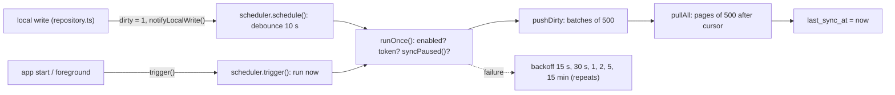

# Sync protocol

Cloud backup is **optional and opt-in**. The phone's SQLite is the source of truth and works 100% offline without ever signing in.
When the person signs in (Google or mobile OTP; see `docs/AUTH.md`) and backup is on, `src/sync` pushes rows marked `dirty` and pulls
everything newer than a cursor. Files: client `src/sync/*`, server `server/src/sync.ts` + `server/src/validate.ts`.
Tables and columns: [DATA_MODEL.md](DATA_MODEL.md).



## 1. Client state

| Where | Field | Meaning |
| --- | --- | --- |
| `households`, `events`, `entries`, `ledgers` | `dirty` | 1 = changed locally, not yet accepted by the server (default 1 for every new row; pulled rows are written with `dirty = 0`) |
| same | `sync_error` | text reason when the server rejected this row; **such rows are skipped** by `collectDirty` and stay `dirty = 1` |
| `sync_state` | `cursor` | highest `server_seq` applied locally (0 = nothing, a full restore) |
| `sync_state` | `user_id` | the cloud account that owns this phone's data; `NULL` = never synced anywhere |
| `sync_state` | `enabled` | backup switch (turned on by signing in, off by sign-out or the Settings button) |
| `sync_state` | `profile_dirty` | "my household" or the village increment changed |
| `sync_state` | `last_sync_at` | shown in Settings as "पिछला बैकअप" |

`pendingCount()` (Settings "भेजना बाकी") counts dirty rows with `sync_error IS NULL`; `countRejected()` counts rows with `sync_error`.

## 2. Triggers and scheduling (`scheduler.ts`, `runtime.ts`)

- **App start** and **app returns to foreground** call `trigger()` (runs at once, resets the failure count).
- **Any local write** calls `schedule()` (debounced 10 s). While backing off, `schedule()` does nothing because the pending retry
  already covers new writes; while running, it sets an "again" flag.
- Single flight: one cycle at a time. Failures are silent.
- **Backoff** `[15, 30, 60, 120, 300, 900] s`, the last repeats. `runOnce()` returns "done, do not retry" (true) for: backup off, not
  signed in, `syncPaused()` (remote maintenance on, or account suspended), `SignedOutError`, `SuspendedError`.
- `syncOnce` = `pushDirty` then `pullAll`, then `last_sync_at`.
- Settings polls the status every 3 s while open; "अभी बैकअप लें" calls `syncSoon()`.
- Maintenance mode: the server answers `503 maintenance` for `/api/auth/*` and `/v1/sync/*`; the app also stops trying while
  `config.maintenance.enabled`. The diary is unaffected.

## 3. Push

`POST /v1/sync/push` (auth required). Body (camelCase, see `src/sync/wire.ts`):

```json
{ "ledgers": [...], "households": [...], "events": [...], "entries": [...], "profile": {"myHouseholdId": "...", "increment": {"type":"FIXED","rupees":51}, "updatedAt": "..."} }
```

### 3.1 Collecting a batch (`collectDirty`)

Up to **500 rows in total** per request, in this order of priority: ledgers, households, events, entries (entries oldest
`created_at` first). The profile rides along on the first batch of a run when `profile_dirty = 1`. A loop keeps pushing until
nothing dirty remains. Timestamps are normalised to fixed-width ISO milliseconds (`isoMs`) because the server compares them as text.

### 3.2 Server handling

1. Body limit ~1 MB (`MAX_BODY`), JSON parse (`400 invalid_json`), whole-request problems are 400 (`batch_too_large` over 500 rows,
   wrong shape).
2. `validatePush`: **per-row** validation. A bad row goes to `rejected[]` (`table`, `id`, `index` in the array the client sent,
   `reason` like `invalid_payload:headName`, never echoing the value) and the other rows continue. Rules include UUID ids, fixed-width
   `updatedAt`, enums, integer paise 0..1e12, string length caps, no NUL characters, `eventId` required for entries, voids must
   target something with zero amounts, `occurredOn` defaults to the date part of `createdAt`, label/note only kept for `OTHER`.
   Duplicates in one batch: households/events/ledgers keep the newest `updatedAt`; entries keep the first copy.
3. `enforceDirections`: entries whose direction disagrees with the event host (`host = me ? AAYA : GAYA`) are rejected with
   `invalid_payload:direction`. "Me" comes from the pushed profile or the stored one; unknown profile/event = accepted;
   voids and corrections are exempt.
4. `pushRows` runs in `withUserTx` (RLS context) with `pg_advisory_xact_lock(hashtext('sync:<user>'))`, one **set-based** statement
   per table over `jsonb_to_recordset`, each assigning `nextval('sync_seq')`:
   - ledgers / households / events / profile: `ON CONFLICT (user_id, id) DO UPDATE ... WHERE EXCLUDED.updated_at > existing.updated_at`
     (strictly newer wins; equal or older is ignored and gets no new `server_seq`);
   - entries: `ON CONFLICT (user_id, id) DO NOTHING` (immutable).
5. Response: `{ ok: true, accepted: {ledgers, households, events, entries, profile}, rejected: [...] }`.

### 3.3 Settling the batch on the phone (`settle`, one transaction)

- For every `rejected` item (except `profile`): `UPDATE <table> SET sync_error = reason(<=200 chars) WHERE id`.
- For every other sent row: `dirty = 0`. Households/events/ledgers use `WHERE id = ? AND updated_at = ?`, so a row **edited while the
  request was in flight keeps `dirty = 1`** and goes in the next round. Entries are immutable, so `WHERE id = ?`.
- The profile becomes clean unless it changed during the request (`updatedAt` compare) or the server refused it.
- The returned count excludes marked rows.

### 3.4 Per-row rejection and `sync_error`

A **poison row** (e.g. a name over 200 characters) must never block the rows behind it, nor be retried forever. It stays on the phone
with `sync_error`; Settings shows "N एंट्री नहीं भेजी जा सकीं" and `/sync-errors` lists a Hindi label of each row
(`listRejected`). "retry" (`retryRejected`) clears every `sync_error`, so the rows are pushed again at the next sync. Editing a
household/event clears its own `sync_error` (`updateHousehold`, `setEventStatus`, `updateEventDetails`). **Entries cannot be edited**,
so a rejected entry can only be retried (useful after an app update that fixes the data) or corrected/voided (a new row).

## 4. Pull

`GET /v1/sync/pull?since=<cursor>&limit=<n>` (`limit` capped at 500, default 500).

- Server: `withUserTx` + `pg_advisory_xact_lock_shared('sync:<user>')`, so a pull never observes a half-committed push (which could let
  the cursor skip rows whose sequence numbers commit out of order). It reads up to `limit + 1` rows **per table** with
  `server_seq > since ORDER BY server_seq`, merges the five lists by `server_seq`, takes the first `limit`, sets `hasMore` when more
  exist and `nextCursor` = the last row's `server_seq` (or `since` when empty). The profile row has no `LIMIT`.
- Client `pullAll`: loop `pull(cursor, 500)` -> `applyPage` -> stop when `!hasMore` or `nextCursor <= cursor`.
- `server_seq` is **global** (one sequence for all users), re-assigned on every insert/update, so an edited household reappears in the
  stream after the entries that reference it.

### 4.1 Applying a page (`applyPage`, ONE transaction, cursor advanced inside it)

1. `PRAGMA foreign_keys = OFF` (an entry can arrive before its household on a later page), and `beginApplying` sets
   `settings.sync_applying` so the direction trigger stands aside.
2. Profile first (`applyProfile`): only if `remote.updatedAt > local.updatedAt`; written straight into `settings` with the server's
   timestamp so it is **not** treated as a new local change; a null remote field never erases a local value.
3. Ledgers, households, events: `INSERT ... ON CONFLICT(id) DO UPDATE ... WHERE excluded.updated_at > table.updated_at`, `dirty = 0`
   (the local-only `photo_uri` and `pin_hash` columns are untouched).
4. Entries: `INSERT OR IGNORE`; an entry without `eventId` (old cloud copy) is attached to a deterministic "पुराना हिसाब" event
   (`ensureLegacyEvent`, see DATA_MODEL 1.9).
5. `endApplying`, `UPDATE sync_state SET cursor = nextCursor`, commit, foreign keys back ON.

All-or-nothing: a crash mid-page leaves the cursor where it was and the page is applied again next time (idempotent).

## 5. Conflict rules (summary)

| Data | Rule |
| --- | --- |
| entries | immutable, first writer wins by id (`INSERT OR IGNORE` / `DO NOTHING`); correction/void are new rows |
| households, events, ledgers | last-write-wins by `updated_at` (text compare of fixed-width ISO); strictly newer replaces |
| profile (my household + increment) | one row, last-write-wins by `updated_at` |
| PIN hashes, photos, voice notes | never synced |

Clock skew between phones decides LWW ties, which is acceptable because entries (the money) never conflict.

## 6. Profile sync and restore on a new phone

"My household" (`settings.my_household_id`) and the village increment sync as one row. On a restored phone, sign-in is followed by
`restoreNow()` (`runtime.ts`, 25 s timeout): a full `syncOnce` from cursor 0, so the household and entries exist **before** first-run
setup is offered. `setup.tsx` also redirects to Home if `my_household_id` arrives while the form is open. If offline, the app
continues and the background sync catches up (setup could be shown once; the later profile pull skips creating a second household only
if it arrives first, so restore while online).

## 7. Account switching (`account.ts`, `switch-prompt.ts`)

`sync_state.user_id` is the owner of the data on the phone. After a successful sign-in, **before anything is saved or synced**
(`completeSignIn`), `bindAccount` decides with the pure `decideBind(owner, signingIn, hasData)`:

| Situation | Result |
| --- | --- |
| owner == signing-in user | bind, no question |
| owner differs (or null) and the phone has **no** data | bind silently |
| owner differs (or null) and the phone **has** data | ask: "इस फ़ोन का डेटा इस खाते में जोड़ें?" |

Answers: **जोड़ें (merge)**: `user_id` set, `cursor = 0`, every household/event/entry/personal ledger and the profile marked dirty with
`sync_error` cleared, so this phone's data is added to the account. **पहले फ़ोन साफ़ करें (wipe)**: `clearAllLocalData`, then restore the
account's data. **रद्द करें (cancel)** or dismissing: nothing changes, the new session is signed out on the server (`/api/auth/sign-out`) and cleared on the phone and the person sees
`CANCELLED_MESSAGE`. `deleteMyAccount` calls `releaseOwner` so the leftover local data counts as "never synced".

## 8. Backup file merge (offline path)

`src/backup/snapshot.ts` `mergeSnapshot` uses the same rules (entries insert-or-ignore, others LWW, rows marked **dirty** so cloud backup
picks them up, PINs untouched, rows pointing at an unknown ledger/household are skipped and counted). It validates with local checks
(ids match `^[A-Za-z0-9_-]{1,64}$`, not strictly UUID).

## 9. Failure modes and debugging

| Symptom | Likely cause | How to check / fix |
| --- | --- | --- |
| "भेजना बाकी" never goes to 0 | offline; maintenance on; account suspended; signed out; backup off | Settings shows "इंटरनेट नहीं मिला"; check `GET /v1/config` maintenance; check `sync_state.enabled`; sign in again |
| "N एंट्री नहीं भेजी जा सकीं" | server rejected rows (`sync_error`) | `/sync-errors` shows the reason: `invalid_payload:<field>` (bad data), `invalid_payload:direction` (event host vs direction mismatch, e.g. "my household" differs between devices) |
| Rejected `direction` after restore | profile `my_household_id` differs from the device that wrote the entries | confirm the `profiles` row; the app that wrote the entry used another "me" |
| 413 `too_large` | body over ~1 MB (very long text fields in a 500-row batch) | rows are capped per field; reduce batch only if fields are huge |
| 401 loops | the server rejected the session -> `SignedOutError` -> sync stops, session cleared | sign in again; local data is untouched |
| 403 `account_suspended` | staff suspended the account | `SuspendedError`: sync stops, Hindi message shown, local use continues |
| 503 `maintenance` | remote config maintenance on | turn off in the admin panel |
| Cursor stuck, `hasMore` true forever | would require `nextCursor <= cursor`; the loop exits | investigate server `server_seq` ordering; run a pull with `since=0` in a test account |
| Duplicate-looking families after merging two accounts | families have different ids on each phone | no automatic de-duplication exists (see ROADMAP known limits) |
| Pushed data missing on the second phone | the first phone has not pushed (dirty), or the second has not pulled | compare `pending` on phone 1; trigger the foreground sync on phone 2 |

Debugging tools:

1. **Unit tests**: `src/sync/__tests__/{engine,features,http,scheduler,stage7}.test.ts` run the real engine against `fake-server.testutil.ts`;
   `server/test/sync.test.ts` runs the real Worker against PGlite with the real migrations.
2. **Inspect the phone DB**: encrypted, so use a debug build with the SQLCipher key, or add temporary logging around `collectDirty`.
   `SELECT id, sync_error FROM entries WHERE sync_error IS NOT NULL` and `SELECT * FROM sync_state` are the first queries.
3. **Server**: the admin panel shows Monitoring (error list with scrubbed messages) and sync request/failure counts
   (Reports > Sync). `analytics`/`user_activity_daily.sync_errors` count failed sync requests per user per day.
4. **Wrangler tail**: `npx wrangler tail` on the Worker shows `console.error('unhandled', ...)`.

## 10. Known limits (relevant to sync)

- Only photos and voice notes are not synced (not built).
- No automatic de-duplication of households across accounts; no per-user storage quota or sync rate limit on the server.
- `settle` clears `dirty` for households/events/ledgers only if `updated_at` matches the normalised ISO value; local timestamps are always
  produced by `toISOString()`, so they match.
- A rejected household does not stop its entries from being pushed; the server has no foreign keys between synced tables.
- End-to-end encryption of synced rows is not implemented: the server can read the cloud copy (staff access is blocked by RLS, not by
  cryptography).
